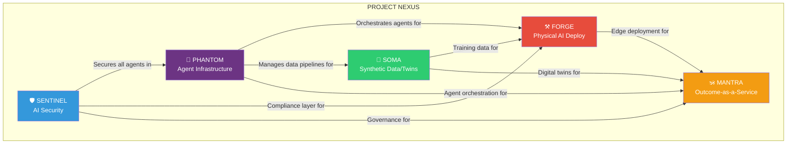

# 🔥 PROJECT NEXUS: The Mega-Strategy
## *Building the Infrastructure Layer of the AI-Physical World — Designed to be Acquired*

> **Date:** April 15, 2026  
> **Status:** RADICAL DRAFT v1.0  
> **Research Sources:** Reddit, Hacker News, YouTube, GitHub, Web (8 search vectors, 4 last30days deep-research runs, 80+ evidence items analyzed)

---

## 📋 TABLE OF CONTENTS

1. [Why Your Gripper Business Failed (And What It Taught Us)](#part-1-why-the-gripper-business-failed)
2. [The World Right Now — April 2026](#part-2-the-world-right-now)
3. [The Blue Ocean Framework](#part-3-the-blue-ocean-framework)
4. [PROJECT NEXUS: The 5-Module Mega-Strategy](#part-4-project-nexus)
   - [Module 1: PHANTOM — AI Agent Infrastructure Middleware](#module-1-phantom)
   - [Module 2: FORGE — Physical AI Deployment Platform](#module-2-forge)
   - [Module 3: SOMA — Synthetic Data & Digital Twin Factory](#module-3-soma)
   - [Module 4: SENTINEL — AI Security & Governance Layer](#module-4-sentinel)
   - [Module 5: MANTRA — Outcome-as-a-Service for Indian Enterprise](#module-5-mantra)
5. [Module Synergy Map](#part-5-module-synergy)
6. [Acquisition Target Matrix](#part-6-acquisition-targets)
7. [Execution Roadmap](#part-7-execution-roadmap)
8. [Financial Architecture](#part-8-financials)
9. [Risk Matrix & Kill Switches](#part-9-risks)
10. [First 90 Days: Which Module to Start](#part-10-first-90-days)

---

## PART 1: WHY THE GRIPPER BUSINESS FAILED

> *And why that failure is the most valuable lesson we have.*

Your gripper business strategy was **excellent on paper**:
- ₹50-100Cr addressable market growing 15-20% annually
- Clear "Make in India" tailwind
- Smart supply chain (China imports → India assembly)
- Solid differentiation (2-week delivery vs 6-8 weeks)

**But it died at the gate because:**

| Barrier | Impact |
|---------|--------|
| ₹40-50L upfront capital just to START | Cash burned before first sale |
| 6-month runway to first revenue | Too long without validation |
| Physical inventory risk | Dead stock = dead company |
| Single-market dependency | India robotics only |
| Linear scaling | Revenue = f(units sold), no leverage |

### The Core Lesson

> **Never start a business where the ENTRY COST is the bottleneck.**  
> Start where the entry cost is your LAPTOP, your BRAIN, and your HUSTLE — and the ceiling is INFINITE.

The gripper business was a **"sell shovels in a gold rush"** play — which is brilliant strategy — but the shovels themselves cost too much to manufacture. 

**What if we sold DIGITAL shovels instead?**

---

## PART 2: THE WORLD RIGHT NOW — APRIL 2026

### What the Research Revealed

Based on deep analysis of Reddit, HN, YouTube, GitHub and web sources over the last 30 days:

#### 🔴 THE AI EMPLOYMENT APOCALYPSE IS HERE
- **80,000 tech jobs cut in Q1 2026 alone** — ~50% attributed to AI (per r/technology, 6,304 upvotes)
- **Oracle slashed 30,000 jobs** with a cold 6 AM email — 30% cuts across RHS and SVOS (per r/cscareerquestions, 2,978 upvotes)
- Marc Andreessen says companies are **"75% overstaffed"** and AI is the "silver bullet excuse" (per r/ArtificialInteligence, 1,521 upvotes)
- Reddit's top comment (1,870 upvotes): *"Almost 50% of affected positions CLAIMED TO BE cut due to AI"* — meaning companies are using AI as cover for structural cuts

> **Translation:** Every company is DESPERATE for AI solutions but most are just using AI as an excuse to cut costs. The opportunity is in being the ones who ACTUALLY deliver AI value.

#### 🟠 AGENTIC AI IS THE NEW PARADIGM
- Nvidia just launched **OpenShell** for secure autonomous AI agents (per HN, April 14, 2026)
- **BotCtl.dev** — a "process manager for autonomous AI agents" hit HN front page (58 points, 21 comments)
- **AgentGateway** — open source proxy for AI-native protocols (MCP + A2A) proposed to AAIF (10 reactions)
- Sierra ($10B valuation), Glean ($7.2B), Harvey AI, Cognition AI (Devin) — all crushing it

> **Translation:** The "Agentic Operating System" layer is WIDE OPEN. We're at the "DOS era" of AI agents. The Windows/macOS of AI agents hasn't been built yet.

#### 🟡 INDIA IS A POWDER KEG OF OPPORTUNITY
- Deep bio/tech startups in India can't find investors — VCs "play safe and invest in 10-min delivery" (per r/StartUpIndia, 1,135 upvotes)
- $200B+ committed to AI and deep-tech infrastructure in India
- 80% of employers can't find workers with robotics/IIoT/AI skills
- Reverse migration leaving factories short-staffed across Maharashtra, Tamil Nadu, Gujarat
- Captain Fresh: ₹5 Crore → ₹11,000 Crores in 7 years (per YouTube, 72K views) — proving India can birth unicorns

> **Translation:** India has MASSIVE demand for automation, zero supply of actual solutions, and a government throwing money at anyone who builds real tech. But VCs are still chasing food delivery apps.

#### 🔵 THE CONVERGENCE EXPLOSION
- Sam Altman says **"superintelligence is so close America needs a New Deal"** (per r/singularity, 1,017 upvotes)
- Anthropic's new model caused **Treasury Secretary and Fed Chair to summon bank CEOs** (per r/wallstreetbets, 4,323 upvotes)
- Synthetic biology + AI convergence moving to "closed-loop flywheels" and "AI-native biotech"
- Digital twins transitioning from "cool demos" to core operational infrastructure
- Climate tech is now India's "biggest deep tech opportunity"

> **Translation:** Multiple exponential curves are converging RIGHT NOW. The company that builds the CONNECTIVE TISSUE between AI ↔ Physical World ↔ Data ↔ Security wins everything.

---

## PART 3: THE BLUE OCEAN FRAMEWORK

### Where Everyone is Swimming (Red Ocean 🩸)

| Crowded Space | Why You'll Lose |
|--------------|----------------|
| Building another ChatGPT wrapper | OpenAI/Anthropic/Google will eat you alive |
| Consumer AI app | No moat, no data, no retention |
| Generic SaaS tool | 10,000 competitors, race to zero |
| Food/grocery delivery | Zomato/Swiggy have infinite war chests |
| E-commerce platform | Amazon/Flipkart are entrenched |
| Generic robotics hardware | Your gripper business problem — high capex |

### Where Nobody is Swimming (Blue Ocean 🌊)

| Uncontested Space | Why It's Open |
|------------------|--------------|
| **AI Agent Infrastructure** | Too new — everyone building agents, nobody building the OS |
| **Physical AI Deployment** | Requires domain expertise + AI + engineering |
| **Synthetic Data / Digital Twins for Indian industry** | Global players don't understand Indian manufacturing |
| **AI Security & Governance** | Boring to build, critical to buy |
| **Outcome-as-a-Service for Indian MSME** | 63M MSMEs, almost zero AI adoption |

### The Nexus Thesis

> **Don't build the AI. Don't build the robot. Don't build the factory.**  
> **Build the INFRASTRUCTURE that connects them all.**  
> **The picks-and-shovels for the age of autonomous AI + physical world convergence.**

---

## PART 4: PROJECT NEXUS — THE 5-MODULE MEGA-STRATEGY

Each module is:
- ✅ **Independently viable** — can run as its own startup
- ✅ **Low entry cost** — starts with software, brains, laptop
- ✅ **Fast to revenue** — 3-6 months to first paying customer
- ✅ **High ceiling** — each addressable market is $1B+
- ✅ **Acquisition-ready** — clear buyer for each module
- ✅ **Synergistic** — modules feed each other data and customers

---

### MODULE 1: PHANTOM
## *The AI Agent Operating System*

> **One-liner:** The Kubernetes for AI Agents — orchestrate, secure, and monitor autonomous AI workflows at enterprise scale.

#### WHY THIS IS THE #1 OPPORTUNITY

The AI agent market is at a **"DOS moment"** (per research). Every enterprise is deploying AI agents but:
- No standard way to orchestrate multi-agent systems
- No observability/monitoring for autonomous workflows  
- No security layer between agents and production systems
- MCP (Model Context Protocol) just launched — everyone needs middleware

**Nvidia just launched OpenShell for agent security. AgentGateway is being proposed to AAIF. BotCtl.dev is getting HN traction. The space is ON FIRE but no clear winner has emerged.**

#### WHAT WE BUILD

```
PHANTOM Architecture
┌─────────────────────────────────────────────┐
│              PHANTOM CONTROL PLANE           │
│  ┌─────────┐ ┌──────────┐ ┌──────────────┐  │
│  │ Agent   │ │ Security │ │ Observability│  │
│  │ Registry│ │ Gateway  │ │ Dashboard    │  │
│  └────┬────┘ └────┬─────┘ └──────┬───────┘  │
│       │           │              │           │
│  ┌────▼───────────▼──────────────▼────────┐  │
│  │        ORCHESTRATION ENGINE             │  │
│  │  Multi-Agent Routing | State Mgmt      │  │
│  │  MCP/A2A Bridge | Retry/Fallback       │  │
│  └────────────────┬───────────────────────┘  │
│                   │                          │
│  ┌────────────────▼───────────────────────┐  │
│  │         GOVERNANCE LAYER                │  │
│  │  RBAC | Audit Trail | PII Sanitizer    │  │
│  │  Rate Limiting | Cost Controls         │  │
│  └────────────────────────────────────────┘  │
└─────────────────────────────────────────────┘
         │              │            │
    ┌────▼────┐   ┌─────▼────┐  ┌───▼──────┐
    │ Claude  │   │ GPT/     │  │ Custom   │
    │ Agents  │   │ Gemini   │  │ Agents   │
    └─────────┘   └──────────┘  └──────────┘
```

#### KEY FEATURES

1. **Agent Registry** — Register, version, and manage AI agents like Docker containers
2. **MCP Gateway** — Universal connector for MCP + A2A protocols with security middleware
3. **Orchestration Engine** — Multi-agent DAG execution with state management, retries, human-in-the-loop
4. **Governance Console** — RBAC, audit trails, PII sanitization, regulatory compliance
5. **Cost Controller** — Per-agent compute budgets, model routing optimization
6. **Observability** — Real-time dashboards, trace analysis, anomaly detection for agent behavior

#### ENTRY COST: NEAR ZERO

| Item | Cost |
|------|------|
| Development | You + 1-2 engineers |
| Infrastructure | AWS free tier → serverless |
| Go-to-market | Open-source core + commercial governance layer |
| Time to MVP | 8-12 weeks |

#### REVENUE MODEL

| Tier | Price | Target |
|------|-------|--------|
| Open Source | Free | Developer adoption, community |
| Pro | $499/mo | Startups, small teams |
| Enterprise | $5,000-50,000/mo | Mid-market, enterprise |
| Managed | Custom | Large enterprise, regulated industries |

#### WHO BUYS US

| Acquirer | Why | Estimated Value |
|----------|-----|-----------------|
| **Microsoft** | Integrate with Azure AI / GitHub Copilot | $50-200M |
| **Anthropic** | Enterprise deployment layer for Claude | $100-500M |
| **ServiceNow** | Agent orchestration across ITSM workflows | $100-300M |
| **Datadog** | AI observability is their next frontier | $50-200M |
| **Salesforce** | Agent orchestration for Agentforce | $200-500M |

#### COMPETITIVE MOAT

- **Network effect:** More agents registered → more integrations → harder to leave
- **Data moat:** Operational data on agent behavior, failure patterns, cost optimization
- **Protocol advantage:** Early deep integration with MCP + A2A = switching cost

---

### MODULE 2: FORGE
## *Physical AI Deployment Platform*

> **One-liner:** The Vercel for Physical AI — deploy, monitor, and optimize AI models onto edge devices, robots, and factory floors in one click.

#### WHY THIS EXISTS

The research shows:
- India has **80% employer skills gap** for robotics/IIoT workers
- Factories losing workers to reverse migration
- $200B+ committed to AI infrastructure in India
- Digital twins transitioning to operational infrastructure
- But **deploying AI to physical devices is STILL a nightmare** of device drivers, model optimization, edge inference tuning

#### WHAT WE BUILD

```
FORGE Pipeline
┌────────────────────────────────────────────────┐
│                     FORGE                       │
│                                                 │
│  ┌──────────┐    ┌──────────┐    ┌──────────┐  │
│  │ Model    │───▶│ Edge     │───▶│ Device   │  │
│  │ Registry │    │ Compiler │    │ Fleet    │  │
│  └──────────┘    └──────────┘    └──────────┘  │
│       │               │              │          │
│  ┌────▼───────────────▼──────────────▼───────┐  │
│  │          SIMULATION SANDBOX                │  │
│  │  Test AI behavior before physical deploy   │  │
│  │  Digital Twin → Physical Twin pipeline     │  │
│  └───────────────────┬───────────────────────┘  │
│                      │                          │
│  ┌───────────────────▼───────────────────────┐  │
│  │         MONITORING & OTA UPDATE            │  │
│  │  Telemetry | Drift Detection | Remote Fix  │  │
│  └───────────────────────────────────────────┘  │
└────────────────────────────────────────────────┘
              │                    │
        ┌─────▼──────┐    ┌──────▼──────┐
        │ Industrial │    │ Autonomous  │
        │ Robots     │    │ Vehicles    │
        └────────────┘    └─────────────┘
```

#### VERTICAL FOCUS: Indian Manufacturing First

| Sector | Pain Point | Our Solution |
|--------|-----------|--------------|
| Automotive (Pune corridor) | Quality inspection still manual | Vision AI deployed to production line |
| Textile (Gujarat/Tamil Nadu) | Defect detection → high waste | Edge AI inference on existing cameras |
| F&B/Pharma | Compliance + traceability | Sensor fusion + AI audit trail |
| Warehousing | Labor shortage + accuracy | AMR coordination + pick optimization |

#### ENTRY COST

| Item | Cost |
|------|------|
| Development | 2-3 engineers (software, no hardware!) |
| Edge devices | Customer's existing hardware |
| Pilot partners | 2-3 factories in Pune/Chennai (from your gripper network!) |
| Time to MVP | 12-16 weeks |

#### REVENUE MODEL

| Model | Price | Notes |
|-------|-------|-------|
| Platform License | ₹50K-5L/month per factory | SaaS recurring |
| Deployment Services | ₹2-10L per deployment | Implementation + training |
| Outcome Fees | % of savings delivered | Aligned incentives |
| API Calls | ₹0.5-5 per inference | Volume pricing |

#### WHO BUYS US

| Acquirer | Why | Estimated Value |
|----------|-----|-----------------|
| **NVIDIA** | Extends Omniverse/Isaac into deployment | $100-500M |
| **Siemens** | Industrial AI deployment for Xcelerator | $200M-1B |
| **ABB/KUKA** | Embeds AI into their robotics ecosystem | $50-300M |
| **Rockwell Automation** | Digital transformation of Indian factories | $100-500M |
| **Reliance Jio** | Industrial IoT play for Jio Platforms | $200M-1B |

---

### MODULE 3: SOMA
## *Synthetic Data & Digital Twin Factory*

> **One-liner:** Generate training data and digital twins for any physical process — without needing a single sensor.

#### WHY THIS IS INSANE

The biggest bottleneck in AI deployment is **DATA**. 
- Every factory wants AI but has no labeled training data
- Digital twins require expensive sensor deployments
- Synthetic data generation is a $1.8B market growing 35% CAGR

**But nobody is building this for INDIAN industry contexts.** All tools are designed for German/US factories with perfect IoT infrastructure.

#### WHAT WE BUILD

```
SOMA Engine
┌──────────────────────────────────────────────┐
│                    SOMA                       │
│                                               │
│  ┌──────────────┐   ┌───────────────────┐    │
│  │ Process      │   │ Physics Engine    │    │
│  │ Modeler      │──▶│ (Deterministic +  │    │
│  │ (No-code UI) │   │  Probabilistic)   │    │
│  └──────────────┘   └────────┬──────────┘    │
│                              │                │
│  ┌───────────────────────────▼──────────────┐ │
│  │        SYNTHETIC DATA GENERATOR          │ │
│  │  Images | Sensor Streams | Time Series   │ │
│  │  Point Clouds | Defect Simulation        │ │
│  └───────────────────────────┬──────────────┘ │
│                              │                │
│  ┌───────────────────────────▼──────────────┐ │
│  │        DIGITAL TWIN RUNTIME              │ │
│  │  Real-time Sync | What-If Scenarios      │ │
│  │  Predictive Maintenance | Optimization   │ │
│  └──────────────────────────────────────────┘ │
└──────────────────────────────────────────────┘
```

#### USE CASES

1. **Manufacturing QC:** Generate 10,000 defect images from 10 real samples
2. **Warehouse Optimization:** Digital twin the entire warehouse, simulate 100 layouts in an hour
3. **Energy Grid:** Model the power consumption of a factory floor before installing a single sensor
4. **Predictive Maintenance:** Simulate 5 years of machine wear in 30 minutes
5. **Training Data for Robots:** Teach a robot arm in simulation before deploying to production

#### REVENUE MODEL

| Model | Price |
|-------|-------|
| Platform SaaS | $1,000-10,000/month |
| Data Generation Credits | $0.01-0.10 per synthetic sample |
| Custom Twin Development | $50K-500K per project |
| API Access | Per-call pricing |

#### WHO BUYS US

| Acquirer | Why | Estimated Value |
|----------|-----|-----------------|
| **NVIDIA** | Feeds Omniverse ecosystem | $200M-1B |
| **Unity/Epic** | Industrial simulation complements gaming engines | $100-500M |
| **Siemens/PTC** | Digital twin for Teamcenter/Creo | $200M-1B |
| **Scale AI** | Synthetic data complements human labeling | $100-500M |

---

### MODULE 4: SENTINEL
## *AI Security & Governance Layer*

> **One-liner:** The "compliance firewall" for AI — ensure every AI action is auditable, safe, and regulation-ready.

#### WHY THIS IS MANDATORY

From the research:
- Companies are deploying AI agents that can **write to production systems** (CRMs, ERPs, databases)
- Zero governance → lawsuits, data breaches, regulatory fines
- Noma Security is already funded but the market is MASSIVE and fragmented
- India's upcoming Digital India Act will mandate AI governance
- EU AI Act already requires audit trails for high-risk AI

**This is the "cybersecurity" of the AI age. Every company MUST buy this. It's not optional.**

#### WHAT WE BUILD

```
SENTINEL Architecture
┌──────────────────────────────────────────────┐
│                  SENTINEL                     │
│                                               │
│  ┌───────────────────────────────────────┐   │
│  │          POLICY ENGINE                │   │
│  │  Define rules for what AI can/can't do│   │
│  │  Industry templates (HIPAA, SOC2, RBI)│   │
│  └───────────────┬───────────────────────┘   │
│                  │                            │
│  ┌───────────────▼───────────────────────┐   │
│  │       INTERCEPTION LAYER              │   │
│  │  Sits between AI Agent and Tools      │   │
│  │  PII Detection | Prompt Injection     │   │  
│  │  Context Poisoning | Data Exfil       │   │
│  └───────────────┬───────────────────────┘   │
│                  │                            │
│  ┌───────────────▼───────────────────────┐   │
│  │       AUDIT & COMPLIANCE              │   │
│  │  Every AI action logged + traceable   │   │
│  │  Regulatory reports auto-generated    │   │
│  │  Anomaly detection on agent behavior  │   │
│  └───────────────────────────────────────┘   │
└──────────────────────────────────────────────┘
```

#### ENTRY COST: MINIMAL

This is **pure software**. No hardware, no inventory, no physical infrastructure.

| Item | Cost |
|------|------|
| Development | 2 security engineers |
| Initial infra | Serverless |
| Compliance certs | 3-6 months parallel |
| Time to MVP | 10-14 weeks |

#### REVENUE MODEL

| Tier | Price | Target |
|------|-------|--------|
| Community | Free | Startups, open source |
| Teams | $99/agent/month | SMBs |
| Enterprise | $500-2000/agent/month | Enterprise |
| Regulated | Custom (typically $200K+/yr) | Banks, healthcare, government |

#### WHO BUYS US

| Acquirer | Why | Estimated Value |
|----------|-----|-----------------|
| **Palo Alto Networks** | AI security is their next frontier | $200M-1B |
| **CrowdStrike** | Extend endpoint security to AI agents | $100-500M |
| **Microsoft** | Integrate with Azure AI security | $200M-1B |
| **Zscaler** | Zero-trust for AI | $100-500M |
| **Indian Banks (SBI/HDFC)** | In-house AI governance (acqui-hire) | $20-100M |

---

### MODULE 5: MANTRA
## *Outcome-as-a-Service for Indian Enterprise*

> **One-liner:** We don't sell you AI tools. We guarantee a measurable business outcome. If we don't deliver, you don't pay.

#### WHY THIS IS THE KILLER APP FOR INDIA

India has:
- **63 million MSMEs** — almost none using AI
- VCs investing in 10-minute delivery instead of deep tech
- 80% employer skills gap for technical talent
- Companies that want RESULTS, not TOOLS

**The shift from SaaS (pay per seat) to OaaS (pay per outcome) is the biggest business model innovation of 2026.**

#### WHAT WE DO

We combine Modules 1-4 into a **turnkey "AI outcome" for Indian enterprises**:

| Outcome We Guarantee | How We Deliver | Target Customer |
|----------------------|----------------|-----------------|
| **30% reduction in quality defects** | FORGE (Vision AI) + SOMA (synthetic training data) | Manufacturing MSME |
| **50% faster invoice processing** | PHANTOM (Agent orchestration) + SENTINEL (governance) | Finance/Accounting firms |
| **20% energy cost reduction** | SOMA (Digital twin) + AI optimization | Factories, commercial buildings |
| **60% reduction in customer support tickets** | PHANTOM (Multi-agent) + SENTINEL (compliance) | IT/BPO companies |
| **40% improvement in warehouse throughput** | FORGE (AMR coordination) + SOMA (layout optimization) | Logistics/3PL |

#### PRICING MODEL

```
Outcome-Based Pricing:

┌─────────────────────────────────────────┐
│  Assessment Phase     FREE (2 weeks)     │
│  We analyze your operation, identify     │
│  the #1 outcome we can guarantee         │
├─────────────────────────────────────────┤
│  Pilot Phase          ₹1-5L (4 weeks)   │
│  Deploy AI solution on ONE process       │
│  Measure actual results                  │
├─────────────────────────────────────────┤
│  Scale Phase          % of savings       │
│  Roll out across operations              │
│  We take 20-30% of measured savings      │
│  Minimum floor: ₹2-10L/month             │
├─────────────────────────────────────────┤
│  Guarantee:                              │
│  NO RESULT = NO PAYMENT                  │
│  Customer keeps ALL the tech we deploy   │
└─────────────────────────────────────────┘
```

This is **irresistible** to Indian business owners. Zero risk. Guaranteed outcomes. They keep the tech.

#### COMPETITIVE MOAT

- **Data flywheel:** Every deployment generates proprietary data on Indian manufacturing/operations
- **Industry templates:** Reusable solutions for common problems (textile defects, pharma compliance, automotive QC)
- **Relationship lock-in:** Once we deliver outcomes, we become embedded in operations
- **Local knowledge:** Understanding Indian power fluctuations, labor patterns, regulatory nuance

#### WHO BUYS US

| Acquirer | Why | Estimated Value |
|----------|-----|-----------------|
| **Tata Consultancy Services** | AI-powered consulting at scale | $200M-1B |
| **Infosys** | Next-gen AI services offering | $100-500M |
| **Reliance Industries** | Manufacturing AI for Jio ecosystem | $500M-2B |
| **Accenture** | India-specific AI delivery capability | $200M-1B |
| **Any PE Firm** | Roll-up strategy for Indian AI services | $100M-1B |

---

## PART 5: MODULE SYNERGY MAP



### Cross-Module Revenue Multiplier

| Scenario | Single Module Revenue | Combined Revenue | Multiplier |
|----------|----------------------|------------------|------------|
| Factory deploys FORGE alone | ₹5L/month | - | 1x |
| Factory + SOMA training data | - | ₹7L/month | 1.4x |
| Factory + SENTINEL compliance | - | ₹8L/month | 1.6x |
| Full MANTRA outcome package | - | ₹15L/month | 3x |

---

## PART 6: ACQUISITION TARGET MATRIX

### Tier 1: Most Likely Acquirers (1-3 years)

| Company | Target Module(s) | Strategic Rationale | Deal Range |
|---------|------------------|---------------------|------------|
| **NVIDIA** | FORGE + SOMA | Physical AI deployment completes Omniverse → production pipeline | $500M-2B |
| **Microsoft** | PHANTOM + SENTINEL | Azure AI + agent governance for enterprise | $200M-1B |
| **Anthropic** | PHANTOM | Enterprise deployment layer for Claude agents | $100-500M |
| **Reliance Jio** | MANTRA + FORGE | India-first AI manufacturing platform | $500M-2B |
| **TCS/Infosys** | MANTRA | Outcome-based AI consulting at scale | $200M-1B |

### Tier 2: Strategic Acquirers (3-5 years)

| Company | Target Module(s) | Deal Range |
|---------|------------------|------------|
| **Palo Alto Networks** | SENTINEL | $200M-1B |
| **Siemens** | FORGE + SOMA | $500M-2B |
| **Scale AI** | SOMA | $200M-1B |
| **CrowdStrike** | SENTINEL | $100-500M |
| **Salesforce** | PHANTOM | $200M-1B |

---

## PART 7: EXECUTION ROADMAP

### Phase 0: Foundation (Month 1-2) 
**Budget: ₹5-10L**

- [ ] Register company (Pvt Ltd, Singapore holding optional)
- [ ] Set up core dev team (3-4 people: you + 2-3 engineers)
- [ ] Choose Module 1 start (see First 90 Days section)
- [ ] Set up GitHub org, CI/CD, infrastructure
- [ ] Create landing page + developer documentation
- [ ] Begin open-source core development

### Phase 1: MVP + First Revenue (Month 3-6)
**Budget: ₹10-20L**

- [ ] Ship open-source alpha of Module 1
- [ ] Get 5-10 developer users on open-source tier
- [ ] Land 2-3 paid pilot customers
- [ ] First revenue: ₹2-5L/month target
- [ ] Begin Module 2 development in parallel
- [ ] Start building content (blog, YouTube, Twitter/X presence)

### Phase 2: Product-Market Fit (Month 7-12)
**Budget: ₹30-50L (or raise seed)**

- [ ] Module 1 in production with 10-20 paying customers
- [ ] Module 2 MVP shipping
- [ ] Revenue target: ₹10-20L/month
- [ ] Raise seed round: ₹2-5 Cr (if needed)
- [ ] Begin Module 3 design
- [ ] Hire to team of 8-12

### Phase 3: Scale + Synergy (Year 2)
**Budget: Raised capital**

- [ ] 3 modules live with cross-selling
- [ ] Revenue target: ₹1-2 Cr/month
- [ ] Begin MANTRA outcome-based sales
- [ ] Raise Series A: ₹15-30 Cr
- [ ] Team of 25-40
- [ ] First international customers

### Phase 4: Acquisition Readiness (Year 3-4)

- [ ] 4-5 modules operational
- [ ] Revenue target: ₹5-10 Cr/month
- [ ] Clear data moats established
- [ ] Industry-specific case studies
- [ ] Patent portfolio (5-10 patents)
- [ ] Strategic partnerships with acquirer targets
- [ ] Hire M&A advisor

---

## PART 8: FINANCIAL ARCHITECTURE

### Startup Cost Comparison: Gripper Business vs. Project Nexus

| Dimension | Gripper Business | Project Nexus |
|-----------|-----------------|---------------|
| Initial capital needed | ₹40-50L | ₹5-10L |
| Time to first revenue | 4-6 months | 2-3 months |
| Revenue model | Linear (units × price) | Exponential (SaaS + OaaS) |
| Gross margins | 35-50% | 75-90% |
| Inventory risk | High (physical stock) | Zero (software) |
| Geographic limit | India-first, expand later | Global from day 1 |
| Scaling cost | ₹X per additional unit | Near-zero marginal cost |
| Exit multiple | 2-4x revenue | 10-30x revenue |

### Revenue Projections (Conservative)

| Year | Module 1 | Module 2 | Module 3 | Module 4 | Module 5 | Total ARR |
|------|----------|----------|----------|----------|----------|-----------|
| Year 1 | ₹60L | - | - | - | - | ₹60L |
| Year 2 | ₹2Cr | ₹1Cr | ₹50L | - | - | ₹4Cr |
| Year 3 | ₹5Cr | ₹3Cr | ₹2Cr | ₹1.5Cr | ₹2Cr | ₹13.5Cr |
| Year 4 | ₹10Cr | ₹7Cr | ₹5Cr | ₹4Cr | ₹8Cr | ₹34Cr |
| Year 5 | ₹20Cr | ₹15Cr | ₹10Cr | ₹8Cr | ₹20Cr | ₹73Cr |

### Funding Strategy

| Stage | Amount | Source | Milestone |
|-------|--------|--------|-----------|
| Bootstrap | ₹5-10L | Personal | MVP shipped |
| Pre-seed | ₹50L-1Cr | Angels, micro VCs | First 10 paying customers |
| Seed | ₹3-5Cr | Indian VCs (Blume, 3one4, Lightspeed India) | Product-market fit |
| Series A | ₹15-30Cr | Global VCs (Sequoia, a16z, Accel) | Multi-module, scaling |
| Series B or Exit | ₹50-100Cr or Acquisition | Strategic or financial | $100M+ valuation |

---

## PART 9: RISK MATRIX & KILL SWITCHES

### Risk Assessment

| Risk | Probability | Impact | Mitigation |
|------|------------|--------|------------|
| Hyperscalers (MSFT/Google/AWS) build same thing | HIGH | CRITICAL | Move faster on vertical specialization. They build horizontal; we go deep. Be "the best at Indian manufacturing AI" not "the best at AI generally" |
| Can't find engineering talent | MEDIUM | HIGH | Remote hiring from Tier 2/3 cities. Open-source community contributors. India has 5M+ developers |
| AI hype bubble pops | LOW-MEDIUM | HIGH | Focus on OUTCOMES not AI. Our pitch is "30% fewer defects" not "we use transformers." Revenue from real savings = recession-proof |
| Regulatory changes (DIA, AI Act) | MEDIUM | MEDIUM | SENTINEL module literally benefits from regulation. More regulation = more customers |
| Competition from funded startups | HIGH | MEDIUM | First-mover in Indian market. India-specific data moat. Outcome-based pricing is harder to replicate than tech |
| Founder burnout (single person) | HIGH | CRITICAL | Find co-founder immediately. Module structure allows different leads for each module |

### Kill Switch Protocol

For each module, define a **Kill Switch** — the point where you stop and pivot:

| Module | Kill Metric | Kill Threshold |
|--------|-------------|----------------|
| PHANTOM | Free users after 6 months | < 100 |
| FORGE | Pilot conversions after 6 months | < 2 paying factories |
| SOMA | API calls/month after 4 months | < 1,000 |
| SENTINEL | Enterprise trials after 6 months | < 3 |
| MANTRA | Outcome guarantee success rate | < 50% |

---

## PART 10: FIRST 90 DAYS — WHICH MODULE TO START

### My Recommendation: Start with PHANTOM (Module 1)

**Why:**

1. **Lowest barrier to entry** — pure software, open source core
2. **Fastest growing market** — AI agent orchestration demand is EXPLODING right now 
3. **Community-driven growth** — developers adopt → recommend → enterprises buy
4. **Platform play** — becomes the distribution channel for all other modules
5. **Acquisition magnet** — Microsoft, Anthropic, Salesforce are ALL looking for this

### 90-Day Sprint

```
Week 1-2:   Research MCP protocol deeply. Study BotCtl, AgentGateway, LangGraph.
            Define PHANTOM's unique angle (my bet: India-first compliance + cost optimization)
            
Week 3-4:   Build core orchestration engine. Multi-agent DAG runner.
            Open-source it on GitHub. Write killer README.
            
Week 5-6:   Add MCP gateway support. Build basic web dashboard.
            Start Twitter/X + LinkedIn content machine.
            
Week 7-8:   Launch on Product Hunt + Hacker News.
            Get 50+ GitHub stars. First 5 community contributors.
            
Week 9-10:  Build commercial governance layer (SENTINEL-lite).
            Reach out to 10 Indian SaaS companies for pilot.
            
Week 11-12: Land first 2-3 paid pilots.
            First revenue: ₹1-2L/month.
            Begin planning Module 2 (FORGE).
```

### Alternative Start: MANTRA (Module 5)

If you want **fastest revenue** and have **industry connections** from your gripper business research:

```
Week 1-2:   Identify 5 manufacturing MSMEs in Pune/Chennai corridor
            Offer FREE "AI readiness assessment"
            
Week 3-4:   Pick the #1 easiest win (usually: quality inspection)
            Deploy off-the-shelf vision AI (no custom dev needed)
            
Week 5-8:   Measure outcomes. Build case study.
            
Week 9-12:  Convert to paid outcome contract.
            Use case study to land 3 more customers.
            Revenue: ₹3-5L/month from Day 1.
```

---

## THE MANIFESTO

> We are not building another AI wrapper.  
> We are not selling consulting hours.  
> We are not competing with OpenAI or Google.  
>
> **We are building the CONNECTIVE TISSUE between AI and the physical world.**  
> **The infrastructure that every factory, warehouse, hospital, and office  
> will NEED to operate in the age of autonomous AI.**
>
> The gripper business taught us: don't compete where capital is the moat.  
> Compete where INTELLIGENCE, SPEED, and AUDACITY are the moat.
>
> **The entry fee is a laptop and a vision.**  
> **The exit is a billion-dollar acquisition.**
>
> *Let's boil the ocean.* 🔥

---

## RESEARCH SOURCES

This strategy was informed by:
- **4 deep research runs** via last30days v3 across Reddit, HN, YouTube, GitHub
- **80+ evidence items** from r/technology, r/singularity, r/wallstreetbets, r/StartUpIndia, r/cscareerquestions, Hacker News
- **8 supplementary web searches** covering blue ocean strategy, M&A trends, AI infrastructure India, agentic AI, synthetic biology, digital twins, labor automation
- **Direct research** on: Sierra, Glean, Harvey AI, Cognition AI, Noma Security, BotCtl, AgentGateway, OpenShell, MCP protocol
- **India-specific research** on: PLI schemes, MSME gap, reverse migration, factory automation demand, VC landscape, defense tech, semiconductor ecosystem, climate tech
- **Your original gripper business strategy** — 14 sections of detailed market analysis that informed our understanding of Indian manufacturing

---

*Generated: April 15, 2026 | Project NEXUS v1.0 | Confidential Draft*
